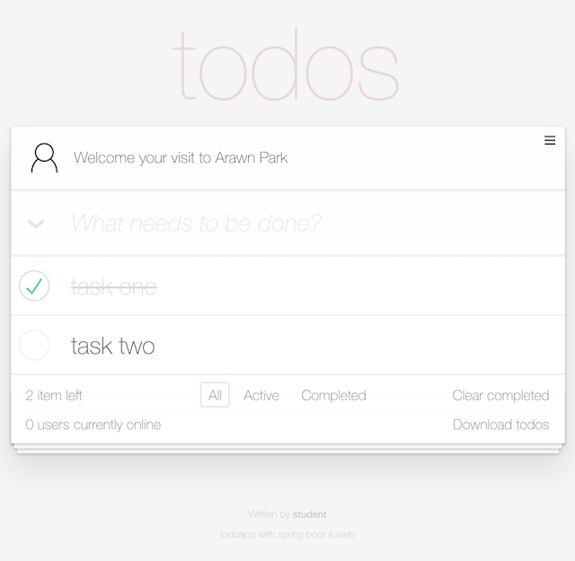

# TodoApp Client

> 이 프로젝트는 [TodoMVC App Template](https://github.com/tastejs/todomvc-app-template/)을 기반으로, [Thymeleaf](https://www.thymeleaf.org/)와 [Vue.js](https://vuejs.org/)로 개발된 웹 클라이언트입니다.

*****

<p align="center">
  
</p>

## 클라이언트 기능

클라이언트는 3개 페이지로 구성되어있습니다.

* **login.html** : 사용자 로그인 페이지 - HTML 폼(form) 전송으로 사용자 로그인을 시도합니다.
* **todos.html** : 할 일 관리 페이지 - AJAX를 사용해 [Web API](https://en.wikipedia.org/wiki/Web_API)를 호출하고, 결과를 출력합니다.
* **error.html** : 오류 페이지 - 서버 발생오류에 담긴 모델을 출력합니다.

### 공통
* 모든 페이지(html)는 Thymeleaf 형식으로 작성되었습니다.
* 모든 페이지 하단에는 사이트 작성자와 설명을 노출하는 기능(푸터, Footer)이 포함되어 있습니다.
    - 서버에서 제공된 모델(Model)에 다음 키(Key)에 해당하는 값(Value)이 있으면 출력합니다.
        - `site.authour`: 사이트 작성자를 출력합니다.
        - `site.description`: 사이트 설명을 출력합니다.

### login.html
* HTML 폼으로 사용자이름(username)과 비밀번호(password)를 입력받도록 구성되었습니다.
* 로그인 버튼을 클릭하면 `POST /login`로 사용자 입력값(username, password)을 전송합니다.
* 서버에서 제공된 모델(Model)에 다음 키(Key)에 해당하는 값(Value)이 있으면 출력합니다.
    - `bindingResult`: [Spring BindingResult](https://docs.spring.io/spring-framework/docs/current/javadoc-api/org/springframework/validation/BindingResult.html) 객체에서 오류 내용을 출력합니다.
    - `message`: 서버에서 전달한 메시지가 있으면 출력합니다.

### todos.html
이 페이지는 Vue.js 기반으로 작성되어 있습니다. 페이지의 기능이 동작하기 위해서는 다음과 같은 Web API가 필요합니다.

할 일(Todo) 관리를 위해 다음 API를 사용합니다.

* `GET /api/todos`: 할 일 목록 조회 또는 CSV 파일 다운로드
* `POST /api/todos`: 새로운 할 일 등록
* `PUT /api/todos/{todo.id}`: 등록된 할 일 수정 또는 완료
* `DELETE /api/todos/{todo.id}`: 등록된 할 일 삭제
* `GET /api/feature-toggles`: 확장 기능 활성화
* `GET /api/user/profile`: 로그인된 사용자 프로필 정보 조회
* `POST /api/user/profile-picture`: 로그인된 사용자 프로필 이미지 변경
* `GET /stream/online-users-counter`: 접속된 사용자 수 변경 이벤트 결과 출력
  - 이벤트 스트림은 [EventSource](https://developer.mozilla.org/en-US/docs/Web/API/EventSource)로 연결

> Web API 응답 상태코드가 40X([클라이언트 오류, Client Error](https://developer.mozilla.org/ko/docs/Web/HTTP/Status#%ED%81%B4%EB%9D%BC%EC%9D%B4%EC%96%B8%ED%8A%B8_%EC%97%90%EB%9F%AC_%EC%9D%91%EB%8B%B5)), 50X([서버 오류, Server error](https://developer.mozilla.org/ko/docs/Web/HTTP/Status#%EC%84%9C%EB%B2%84_%EC%97%90%EB%9F%AC_%EC%9D%91%EB%8B%B5))라면, 응답 바디에 담긴 오류 모델을 출력합니다. 보다 자세한 내용은 [error.html](#errorhtml) 을 참조바랍니다.

> [Todoapp Web APIs Document](https://app.swaggerhub.com/apis-docs/code-rain/todoapp/1.0.0-snapshot)에서 보다 상세한 WEB API 스펙을 확인할 수 있습니다.

### error.html
* 서버에서 제공하는 모델(Model)에 다음 키(Key)에 해당하는 값(Value)이 있으면 출력합니다. 
  - `path`: 오류가 발생한 URL 경로(path)
  - `status`: HTTP 상태코드
  - `error`: 오류 발생 이유
    - `errors`: 스프링 BindingResult 내부에 모든 ObjectErrors 객체 목록
  - `message`: 오류 내용
  - `timestamp`: 오류 발생시간

*****

## 프로젝트 구성

[Thymeleaf](https://www.thymeleaf.org/)와 [Vue.js](https://vuejs.org/)로 개발하고, [Vue CLI 3](https://cli.vuejs.org/)으로 관리하고 있습니다.

### 디렉토리 구조

```
├── dist
├── public
├── src
├── mock
├── babel.config.js
├── vue.config.js
├── package.json
└── yarn.lock
```

* **src**, **public** : 클라이언트 소스 코드
* **mock** : 클라이언트 개발시 사용된 Mock 서버, [json-server](https://github.com/typicode/json-server)로 구동
* **dist** : 빌드(`yarn build`) 명령으로 생성된 배포본

### 의존성 관리

패키지 의존성 관리를 위해 [얀(yarn)](https://yarnpkg.com/en/)을 사용하며, 클라이언트 개발에 사용된 의존성은 `package.json` 명세파일에 선언되어 있습니다.

### 프로젝트 설정
> 클라이언트 빌드를 위해서 `yarn`이 설치되어 있어야 합니다. 설치관련 내용은 [Yarn Installation](https://yarnpkg.com/en/docs/install)를 참조바랍니다.

```
$ git clone git@github.com:springrunner/todoapp-client.git
$ cd todoapp-client
$ yarn install
```

## 참고자료     

* [TodoMVC App Template](https://github.com/tastejs/todomvc-app-template/)
* [Thymeleaf](https://www.thymeleaf.org/)
* [Vue.js](https://vuejs.org/)
* [Yarn Installation](https://yarnpkg.com/en/docs/install)
* [Vue CLI 3](https://cli.vuejs.org/)

## 라이선스(License)

저장소 내 모든 내용은 [MIT 라이선스](https://en.wikipedia.org/wiki/MIT_License)로 제공됩니다.
